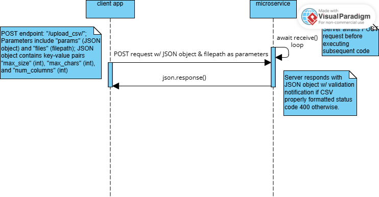

## Description
This microservice validates a CSV file sent over REST. It checks:
- Maximum file size  
- Maximum characters per cell  
- Required number of columns per row  

It returns a JSON response indicating whether the CSV is valid and, if not, what errors were found.

---

# Communication Contract

## 1. Installing

1. Install Python 3.13 or higher (https://www.python.org/).

2. Navigate to application directory.

3. Create Python virtual environment using "python -m venv .venv" command"

4. Activate virtual environment (platform-specific):
    On Windows: Use command .\venv\Scripts\activate
    On macOS and Linux: source venv/bin/activate

5. Install required package "fastapi" using following command: "pip install fastapi"

---

## 2. Starting the Application

Start the server using:

```bash
uvicorn data_validation_group:app --reload
```

The microservice will be available at:

```
http://127.0.0.1:8000
```

---

## 3. How to Request Data from This Microservice

### Endpoint
```
POST /upload_csv/
```

### Required Query Parameters
| Parameter     | Type | Description |
|---------------|------|-------------|
| max_size      | int  | Maximum allowed file size in bytes |
| max_chars     | int  | Maximum allowed characters per CSV cell |
| num_columns   | int  | Required number of columns for each row |

### Required Form Data
| Field | Type | Description |
|-------|------|-------------|
| file  | file upload | CSV file to validate |

---

## 4. Example Request

```python
import requests

def main():
    url = "http://127.0.0.1:8000/upload_csv/"
    params = {
        "max_size": 10485760,
        "max_chars": 100,
        "num_columns": 5
    }

    try:
        with open("test2.csv", "rb") as f:
            files = {"file": f}

            print("Sending request to CSV microservice...")
            response = requests.post(url, params=params, files=files)

            print("Status code:", response.status_code)
            print("Raw text:", response.text)
            print("As JSON:", response.json())
    except Exception as e:
        print("Error while calling microservice:", repr(e))

if __name__ == "__main__":
    main()
```

---

## 5. Sequence Diagram



---